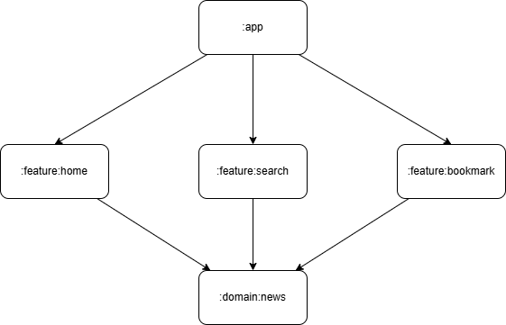
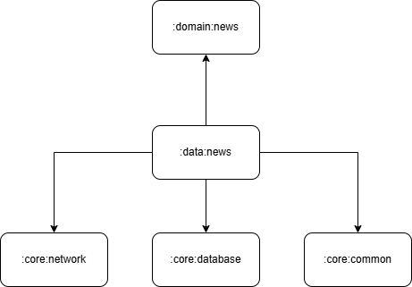
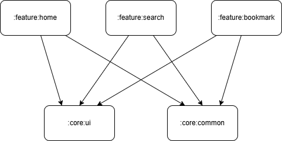

# NewsApp

## Introduction

NewsApp is an Android application that helps users stay up to date with the latest news from around the world. The project is built with a modular architecture to ensure scalability, maintainability, and clean code organization.

## Features

* Browse breaking news in real time
* Get personalized news recommendations
* Search for articles by keywords
* Save/bookmark favorite articles for later reading
* Smooth and responsive UI with Jetpack Compose

## Technologies Used

* **Kotlin** – Main programming language
* **Jetpack Compose** – Modern UI toolkit
* **Modularization, Clean Architecture** – Separation of concerns across modules (app, core, domain, data, feature)
* **Koin** – Dependency Injection
* **Retrofit** – Network API calls
* **Coroutines & Flow** – Asynchronous programming
* **Navigation Compose** – In-app navigation

## Dependency Graph

